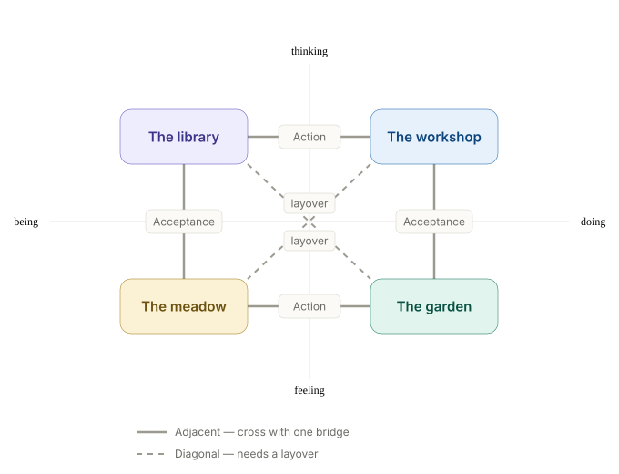

## At a glance

This began as a productivity guide. It still is, in a sense, but not productivity through force.

The deepest shift is simpler than most systems make it sound: **match the task to the state**. When task and state align, things often feel strangely easy. When they don't, even simple things can feel expensive.

Recall a time you tried to write but the words wouldn't come — sitting at a computer or notebook trying to force it. Now recall a time when the words flowed freely and hours passed like seconds. The difference wasn't that you were better or worse at writing. The task was the same. What differed was the alignment between the task and your state. How often do we do micro versions of that — trying to force productivity when we're tired, or force rest when we should be moving?

This guide is about learning to notice alignment — and misalignment — earlier:

- When to stay with the task
- When to switch tasks
- When to change your state instead
- How to build a life where more of your effort goes into movement rather than correction

---

## The Fundamental Algorithm

**When you know what to do → flow**  
**When you don't know what to do → pause**  
**Align your current task with your current state**  
**Periodically check to make sure you're still aligned**  

That's the core of it.

Most productivity systems overvalue doing. Contemplative systems can overvalue being. Life asks for both, along with feeling and thinking. The art isn't choosing one forever. The art is learning what's needed now and honoring it.

This isn't about doing more. It's about doing what's aligned when action is called for, and having the wisdom to wait when it's not.

### Wu Wei: Effortless Effort

When task and state align, you enter what Taoists call *wu wei* — effortless action. It doesn't mean doing nothing. It means moving with the current instead of against it. It means recognizing that sometimes rest is the most productive thing you can do.

Think of it like surfing. You can't control the waves, but you can learn to read them — to wait for the right moment, to paddle at the right speed, to stand with balance. You need the right waves (you can't surf when it's flat). You need to read them (attention and prediction). You need strength to paddle (to match your speed to theirs). And you need balance to stand and ride. That's alignment.

When task and state align:

- Words flow
- Energy appears
- Presence deepens
- Life feels lived, not survived

But to navigate consciously, you need to understand the landscape you're navigating. Let's map it.

---

## Part I: The Landscape

### The Two Axes

This framework holds two familiar distinctions together as one navigable field. Each is a continuum you're always somewhere along:

You stand somewhere on both at once. Right now, for example, you might be Thinking (processing these words), Doing (actively reading), Feeling (perhaps curious or skeptical), and Being (sitting, resting as awareness) — all at the same time.

That last point matters more than it looks. These axes aren't walls, and they aren't either/or. You can think *and* feel; you can be present *while* acting. The poles don't mark what's *allowed* — they mark what's *leading*. So the four territories below aren't sealed rooms; they're regions you gravitate toward depending on what currently has the loudest claim on your attention. The most aligned states often sit near the center, where all four are awake at once and none is shouting. That center is close to what *wu wei* points at.

### The Four Territories

These axes create four natural territories.

A note on the names: *a meadow grows on its own; a garden requires tending.* Both are living spaces, but one invites you to rest in it while the other invites you to work with it. That distinction — being with feeling versus acting from feeling — is the heart of the lower half of the landscape.

These are simply the names that resonated with me. If others fit your inner landscape better — a Studio instead of a Garden, a Sanctuary instead of a Meadow — use those. The map matters more than its labels, and naming a territory in your own words is part of making it navigable.

#### The Library (Thinking + Being)

This is where you reflect, strategize, see patterns, and integrate understanding. Your body is still but your mind is active, making connections.

Explore the Library (signals, shadow side & uses)

**What it's for:** Morning pages, strategic planning, integrating lessons, seeing patterns, philosophical thinking, big-picture reflection.

**Feels like:** Spacious curiosity, quiet insight, gentle wondering. A sense of the pieces rearranging themselves without you forcing them.

**Body signals:** Stillness in the limbs, relaxed posture, a settling quality. Your breathing slows. The mind feels expansive — not grasping for answers, but allowing them to surface.

**When it works:** Insights emerge, patterns become clear, understanding deepens. You walk away with something you didn't have before — not because you built it, but because you saw it.

**Shadow side:** Rumination. Analysis paralysis. Thinking about thinking about thinking. The Library's shadow looks productive — it wears the costume of depth — but nothing moves. You can spend weeks "processing" something that needed ten minutes of honesty and a single action. If you've been in the Library for days and nothing has crystallized, you're probably avoiding one of the other territories.

#### The Workshop (Thinking + Doing)

This is where you solve problems, plan projects, analyze data, and build. Your mind is sharp, your body engaged with purpose.

Explore the Workshop (signals, shadow side & uses)

**What it's for:** Planning a trip, analyzing your budget, writing documentation, strategic problem-solving, debugging, building systems.

**Feels like:** Focused intensity, forward momentum, sharp clarity. The satisfying feeling of things clicking into place.

**Body signals:** Forward lean, focused gaze, tight shoulders, quick and precise movements. Energy concentrated in the head and hands. You might not notice hunger or thirst.

**When it works:** Time disappears, solutions emerge, progress is tangible. The gap between what you intended and what exists closes visibly.

**Shadow side:** Mechanical production — efficient but hollow. The Workshop's shadow is one of the most socially acceptable places to hide, because it looks like productivity. You can build elaborate systems around a feeling you don't want to sit with, or fill every waking hour with tasks to avoid the quiet where grief or loneliness might find you. If you're producing but nothing you make feels meaningful, the Workshop has become a hiding place.

#### The Meadow (Feeling + Being)

This is where you rest, grieve, appreciate, and simply exist. You're receptive to sensation and emotion without needing to act on them.

Explore the Meadow (signals, shadow side & uses)

**What it's for:** Sitting with grief or joy, savoring stillness, gentle stretching, processing emotions, deep rest, simple appreciation. Being present with whatever's here without agenda.

**Feels like:** Open awareness, emotional presence, receptivity, groundedness. Sometimes tender. Sometimes boring. Both are fine.

**Body signals:** Awareness of breath, heartbeat, the weight of your body against whatever's supporting it. Softness in the jaw and belly. Sensations you normally override — the texture of your clothing, the temperature of the air, the hum of a room — become available.

**When it works:** Restoration happens without effort. Emotions that were stuck begin to move. Not because you processed them, but because you stopped blocking them. Presence deepens. You remember what it feels like to simply be here.

**Shadow side:** Stagnation — rest that becomes hiding. Being is a skill and a gift, but it can also become the place you retreat to when action feels scary. If "I need to rest" has become your answer to everything, including things that genuinely need tending, the Meadow has shifted from restoration to avoidance. The honest test is whether you feel more resourced after time here, or just more distant from what's waiting.

#### The Garden (Feeling + Doing)

This is where you create from the heart, connect through action, and tend to living things and living relationships. You're active, but led by feeling rather than analysis.

Explore the Garden (signals, shadow side & uses)

**What it's for:** Playing music, having a heartfelt conversation, cooking intuitively, dancing, playing, tending plants, connecting with others, passionate creation, responding to what the moment needs.

**Feels like:** Expressive flow, embodied warmth, aliveness. A responsiveness — you're not planning your next move, you're meeting what's in front of you. The action arises from care, not calculation.

**Body signals:** Animated movement, open posture, responsiveness in the hands and face. Energy flows outward rather than inward. You feel warm, engaged, sometimes buzzing.

**When it works:** Expression feels natural, connection deepens, creativity flows from a place that's deeper than thought. You're not performing — you're responding. The thing you're tending (a meal, a person, a song, a garden bed) seems to guide the action as much as you do.

**Shadow side:** Porous boundaries — giving until you're empty without noticing until you're depleted. The Garden's shadow isn't chaos; it's the warmth that makes connection possible becoming the warmth that makes it impossible to stop pouring. You tend everyone else's garden and neglect your own. If you consistently leave conversations, gatherings, or creative sessions feeling drained rather than nourished, you're in the Garden's shadow. The remedy isn't to leave the Garden — it's to tend the boundary as carefully as you tend everything else.

---

## Part II: Navigation

You have the map. Now you need a compass — and the honesty to read it. Locating yourself takes two things: the ability to look, and the willingness to accept what you find. Navigation begins with a simple premise: work from where you already are. The rest of this part is about reading your position, matching the work to your current ground, the instruments that move you (attention and bridges), and the gentle art of shifting state when a transition is truly necessary.

### Reading your position

Your body often knows before your story does. Notice your physical posture and sensation:

- **Workshop:** Focused gaze, forward lean, tight shoulders. Energy concentrated in head and hands.
- **Library:** Stillness, relaxed posture, a settling quality. Mind active, body quiet.
- **Meadow:** Awareness of breath, heartbeat, the weight of your body. Softness in jaw and belly.
- **Garden:** Animated movement, open posture, warmth. Energy flows outward toward the world.

When none of these descriptions match — when you feel foggy, flat, or scattered — you may be in a transition zone or a shadow state. That's information, not failure.

Useful check-ins:

- **Morning:** Where am I starting?
- **Before a task:** What territory does this task need — and where am I?
- **When stuck:** Am I forcing the wrong state?
- **Evening:** What territory needs tending now?

### When to navigate and when to switch tasks

Whenever possible, the wisest move is to select a task that matches your current state.

This is where most productivity advice fails. It assumes you can always navigate to the "right" state. Traditional productivity tells you to rank tasks by urgency, pick the top one, and force yourself into whatever state it demands. But forcing a misaligned state is wildly expensive. Trying to do analytical Workshop tasks from the Meadow costs three times the energy and produces half the quality.

Priorities matter, but alignment often matters more: **it's almost always better to choose a secondary task that matches your current state than to force a state shift for the "top priority."** An aligned task gets done in an hour of flow; a forced task burns half a day in friction, creates errors, and leaves you depleted for everything else.

Some days you're in the Meadow and everything on your list needs the Workshop. Those days, tend your meadow. The Workshop is not helped by contempt.

**Change *task* to align with your current state when:**

- You have flexibility in what you tackle next
- You're already depleted
- The gap between where you are and where the task needs you to be is too wide
- Forcing state would cause harm

However, sometimes the right move is to change your state to meet a necessary task.

**Change *state* when:**

- The task truly can't wait
- You have energy to spend on the transition
- The distance isn't too far (adjacent territories)

### Enabling Task Selection: Expanding the Menu

There's a practical hitch with "switching tasks to match your state": **almost every traditional to-do list item is exclusively Workshop territory.**

When most of us look at our task managers, calendars, or scraps of paper, we see chores, tickets, and "work". Every item demands Thinking + Doing. If you wake up or land in the Meadow (tired, settled, receptive) or the Garden (craving warmth and human connection), looking at a list made entirely of Workshop tasks traps you. You feel compelled to force yourself into the Workshop because nothing else is "on the list." Switching from one Workshop task to another does nothing to resolve the misalignment.

To make task selection actually work, you have to intentionally broaden what counts as a valid, worthwhile "task":

- **Workshop:** Building, fixing, analyzing, organizing, budgeting, handling logistics.
- **Library:** Reading a book, studying a concept, journaling, synthesizing notes, big-picture reflection.
- **Garden:** Texting someone, cooking, cleaning, practicing yoga, playing music, tending a relationship, actual gardening.
- **The Meadow paradox:** The Meadow is vital, yet it actively resists "tasks". People don't usually put "rest" or "grieving" on a standard to-do list. Trying to schedule the Meadow turns it into a chore.

When you broaden your menu beyond the Workshop, task selection becomes an actual choice rather than a theoretical luxury. When you notice you're in the Library, you read. When you find yourself in the Garden, you reach out to someone. And when you find yourself in the Meadow, you don't force any activity at all — you allow yourself to truly rest, replenishing the fuel that every other territory will need later.

### Attention: The Lever That Moves You

In the companion essay "[Attention as Lever](https://onbalanceproject.com/modules/attention-as-lever)," we explored how attention amplifies whatever it rests on. But attention alone isn't enough — you also need to sense where you are before you can choose where to direct it.

**Attention is your compass and your engine.** Where you place it determines which territory you move toward and which patterns you amplify:

- Attention on breath → moves toward Being
- Attention on sensation or emotion → moves toward Feeling
- Attention on problems or concepts → moves toward Thinking
- Attention on action or movement → moves toward Doing

Left unchecked, we drift into default territories — usually the most familiar one. With awareness, we can choose: to pause instead of force, to feel instead of over-analyze, to act instead of stagnate.

### The Bridges Between Territories

You rarely teleport between territories. You usually cross by way of a bridge.

The map shows it at a glance: neighbors share an axis, so a single bridge gets you across. Territories on a diagonal differ on *both* axes — there's no direct route, only a layover.

Explore the routes (adjacent bridges & diagonal layovers)

**Adjacent bridges** (these cross one axis):

- **Thinking → Feeling** (*Mindfulness*): Notice thought until sensation surfaces underneath it. Let analysis soften into sensing.
- **Feeling → Thinking** (*Articulation*): Name what you feel. Words create structure around raw experience.
- **Being → Doing** (*Intention*): Let stillness crystallize into purposeful action. One breath, one step.
- **Doing → Being** (*Release*): Complete something — or consciously set it down. Let the momentum settle.
- **Feeling → Doing** (*Passion*): Let care or desire become energy that moves you.
- **Doing → Feeling** (*Empathy in Motion*): Discover what you feel by noticing what happens in your body as you act.
- **Being → Thinking** (*Intuition*): Let insight arise from stillness rather than effort.
- **Thinking → Being** (*Contemplation*): Lay down the thought gently. Let understanding settle into presence.

**Diagonal crossings** (these cross both axes — and need a layover):

You can't leap directly from Library to Garden or from Meadow to Workshop. You need an intermediate stop:

- **Library → Garden:** Detour through the Workshop (think → act → feel) or through the Meadow (think → feel → act).
- **Meadow → Workshop:** Articulate what you're feeling first (feel → think) or engage light movement (be → do), then move to focused action.

### Common Misalignments

Learn to recognize these patterns:

- **Thinking Override:** Trying to logic through grief or emotion. You need the Meadow first — not more analysis.
- **Doing Addiction:** Mistaking motion for progress, never resting. Your Workshop has become a hiding place.
- **Feeling Flood:** Overwhelm that blocks clarity or action. You need a Thinking bridge — articulation, naming.
- **Being Bypass:** Using "presence" to avoid difficult tasks. Honest assessment, not more stillness.
- **Forced Leaps:** Trying to jump from Library to Garden without a bridge. Slow down. Find the layover.
- **Wrong Territory Work:** Doing a task from a territory next door to the one it actually needs — building in the Workshop when the work wants the Garden, analyzing a grief that needs the Meadow, planning while exhausted when the honest move is rest. The task isn't the problem; the territory is.

### Resistance vs. Resilience

Sometimes resistance means you're in the wrong territory. Sometimes it means you're avoiding something important. The difference matters.

**Territory mismatch** feels like:

- Fog when trying to think
- Heaviness when trying to act
- Numbness when trying to feel
- Restlessness when trying to be still

**Avoidance** feels like:

- Sharp fear about a specific task
- Sudden "inspiration" to do something else entirely
- Elaborate justifications for why now isn't the time
- A pattern of always skipping the same kind of thing

**The test:** If you skip a task for another *in the same territory*, you're probably avoiding. If you skip it for something in a *different territory*, you're probably honoring your location.

Sometimes you have to move through discomfort to do what's aligned. The art is knowing which is which. When in doubt, go gently. But go.

---

## Part III: The levers of navigation

These are the internal tools that make navigation possible. None of them work in isolation — they compound.

### Awareness

Without awareness, you drift. With it, you can navigate intentionally. Awareness isn't effort — it's simply noticing where you are without judgment. It's the act of checking the dashboard before deciding where to steer.

### Attention

Awareness tells you where you are; attention directs where you go next. As explored in [Attention as Lever](https://onbalanceproject.com/modules/attention-as-lever), what you pay attention to is amplified. Where you place it is where you go.

### Intention

Intention is what crystallizes Being into purposeful Doing. A breath, a note written down, a tiny initial step. It doesn't need to be dramatic. The smallest deliberate choice shifts your entire trajectory.

### Feedback and Reflection

Rapid, accurate feedback is one of the most valuable things you can cultivate. Reflection closes the loop between action and understanding, turning raw experience into intuition and calibration over time.

### Motivation

A mind with a *why* can handle any *how*. Meaning, purpose, and clear goals fuel the system; values steer it. Without them you can make lots of progress in the wrong direction, and will eventually run out of fuel.

### Validation

Check your goals regularly. That goal you've been carrying for two years — is it still yours? Did it ever really belong to you? So many desires at every level — including big life goals — actually come from outside ourselves. They're implanted by marketing, social pressure, or that insidious voice that says you "should." Borrowed desires are worse than useless — they're actively draining. They take up space where your real desires could grow.

### Energy > Time

Time is fixed. Energy varies. Prioritization helps, but energy management determines what's actually possible on any given day. Rest isn't wasted time — it's recovered capacity.

Each territory burns a different kind of fuel:

- **Workshop** burns mental energy (decisions, analysis) — restored by mental rest, simple physical tasks
- **Garden** burns emotional energy (feeling-work, connection) — restored by boundaries, solitude, time in the Meadow
- **Library** burns attention energy (focus, concentration) — restored by wandering, play, unstructured time
- **Meadow** burns presence energy (the subtle effort of simply being) — restored by true rest, sleep

You can have plenty of one type while being depleted in another. This is why you can feel physically energized but emotionally exhausted, or mentally sharp but unable to be present. Knowing which fuel you're low on tells you which territory needs protecting — and which ones are available.

---

## Practical Application

Ready to put this map into daily practice? Explore the companion **[Practice Worksheet](https://onbalanceproject.com/modules/the-alignment-system/worksheet.md)** for:

- Sizing tasks for flow (MVP thinking) and working in rhythm
- The full Predict → Do → Review calibration loop
- Backlog pruning and consciousness-forcing task labeling
- The 7-day territory tracking experiment and daily check-in templates

---

## Conclusion: Navigation, Not Perfection

The goal isn't to master the system. It's to know your landscape well enough that navigation becomes natural — like knowing your neighborhood so well you don't need a map.

- When stuck → locate yourself
- When forcing → switch tasks, or find a gentler bridge
- When flowing → notice what enabled it
- When aligned → ride the wave

This isn't about productivity. It's about balance — dynamic, living, always in motion. About knowing when to Do, when to Think, when to Feel, and when to simply Be.

The waves aren't always up for surfing, but when they rise, the goal is to be ready to ride them.

Being, Doing, Feeling, and Thinking aren't rivals. They're coordinates. The art is navigation.
